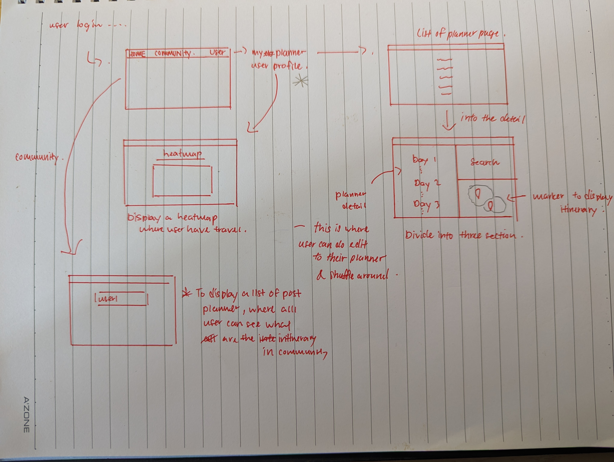

# TRAAPP [Travel App]

## Description

Introducing TRAAPP, the ultimate travel companion that connects you with a community of like-minded explorers! With our innovative planner feature, you can discover and get inspired by real travel itineraries shared by our community of users. Browse through their posts and uncover hidden gems from around the world.

But that's not all TRAAPP also allows you to plan your own trips with ease. Create your personalized travel planner, add destinations and share it with the community. Join our community today and start planning your dream trip!

## Technology Stacks

- PERN stack (Posgress, Express, React, Node)
- Redis
- Beekeeper
- Neon
- CSS
- Tailwind CSS
- Daisy UI
- Flowbite
- Javascript
- MapBox
- Github
- API used : Google Map Service

### Deployment

This app is deployed via Render ➡️ [TRAAPP](https://travelapp-mf7k.onrender.com/)

## The Travel App

### Initial phase

I first sketch out what i want my app to like and this is the initial idea to get me kick start into the app development process.

After getting a rough idea how my app would like, i also table out what should be in my data model to support evrything that should interfacing in my app, and this is how it looks like.

### There are 2 main relationship for my [data model](https://docs.google.com/spreadsheets/d/1QIS8kAzXtEgEtM1gxsI80aBACUWDN2A9SSWczFl07z8/edit?gid=0#gid=0), between

- users and usersviewer (for displaying view count of a user)
- user, planner, planner_items and planner_locations_items (display the whole user planner)

So this serve as the model which my backend server will be querying.

## Kicking into development process

Developing a full stack application is defenitely a worthy experience where you can gain perspective when coding in frontend and backend. During developent phase, its always easy to get lost, so to cope with that, my sketch and data model which was produced during the planning phase serve as a guide for me.

## The Result

### Community Page

Upon launching the [app](https://travelapp-mf7k.onrender.com/), community page will be the page you land into, where you can view all members in the community what their intinerary look like and you can also view their profile by clicking their name and view their plans when clicking the post !

### Planner Page

When you click the 'Create' button, you'll be taken to a planner page where you can start building your dream trip. Simply add destinations from the search results, and then drag and drop items between days to customize your itinerary. Plus, you can easily delete any location if you change your mind - it's that flexible!

### User Profile

On this page, users can view their list of itineraries and explore their personalized heatmap. As they add more destinations to their planner and complete their trips, the heatmap will gradually cover the locations, providing a visual representation of their travel history. Additionally, users can delete their planners from this page if needed.

### Sign Up page

However, all these features are limited to members only, except for browsing the community page. Otherwise, you'll be redirected to the sign-up or login page.

### Future Development

- Adding distance calculation between markers
- Interaction between users

### Summary

Developing everything from scratch can be challenging, but throughout this project, I've learned the importance of simplicity and building small functions that serve specific purposes. As when developing throught the project, the function can get more and more complex. So keeping things straightforward and focusing on creating small, unique functionalities has been key to the project's success. By breaking down tasks into small components, we can ensure a smoother development process.
